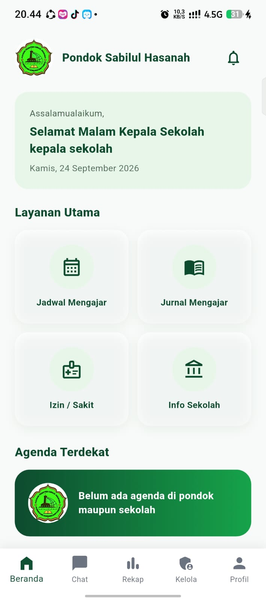
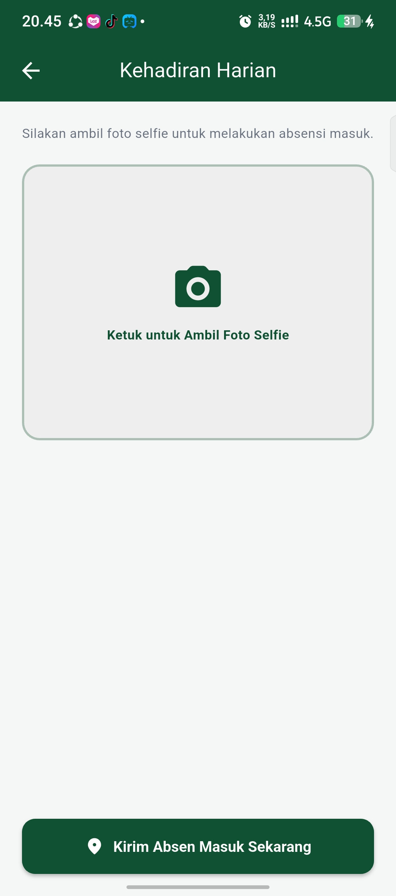
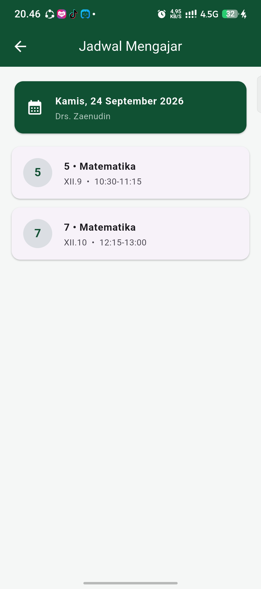
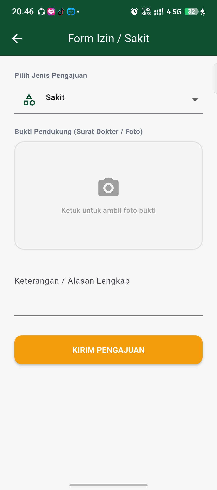
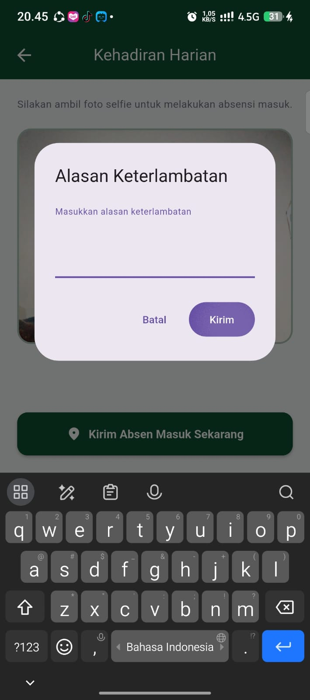
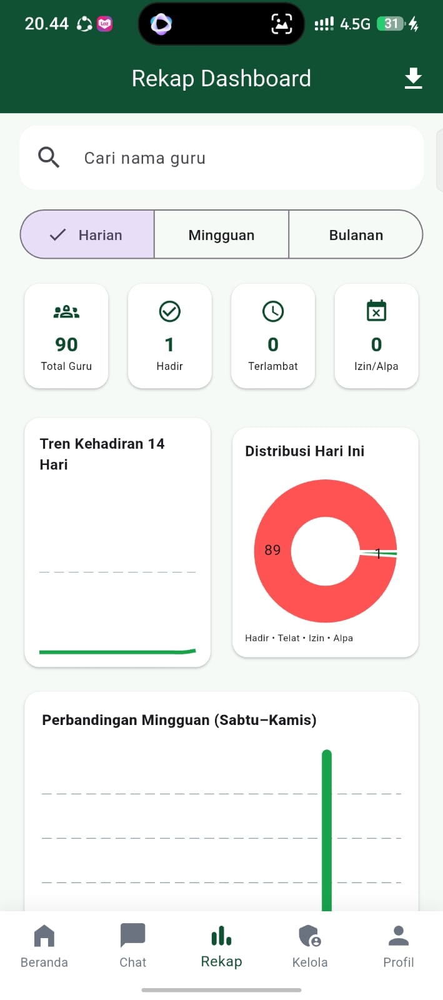
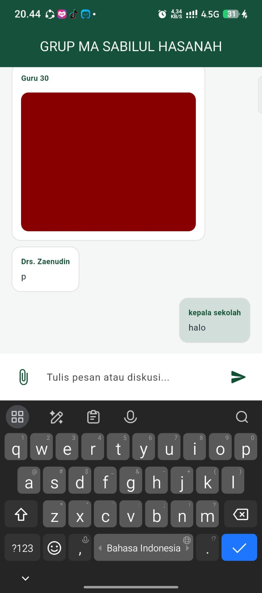

AbsenMA adalah aplikasi cross-platform berbasis Android yang saya kembangkan untuk mendigitalisasi proses absensi harian guru serta mempermudah koordinasi administrasi di lingkungan madrasah. Proyek ini saya bangun untuk mengatasi masalah operasional sekolah yang tadinya masih konvensional (pakai rekap kertas atau absen manual) menjadi sistem yang transparan, terintegrasi, dan bisa dipantau secara real-time oleh pihak pengelola.

Penjelasan Detail Fitur.
1. Sistem Autentikasi Multi-Role & Manajemen Akun Skala Menengah

Cara Kerja: Aplikasi membedakan hak akses secara ketat antara Admin (Kepala Sekolah/Pengelola) dan Guru.

Saya merancang sistem registrasi dan manajemen data untuk 45+ akun pengguna secara otomatis di database. Admin memiliki dashboard khusus untuk kontrol data, sementara guru disajikan antarmuka (user interface) yang ringkas dan bebas dari menu rumit agar proses harian cepat selesai.

2. Validasi Kehadiran Berbasis Geo-Fencing &  GPS

Cara Kerja: Menggunakan package geolocator, aplikasi ini membaca titik koordinat GPS perangkat guru saat tombol absen ditekan, lalu menghitung jaraknya secara akurat terhadap titik pusat madrasah (dibatasi dalam radius maksimal 2 KM).

Fitur ini dilengkapi sistem keamanan berlapis yang mendeteksi apakah perangkat pengguna mengaktifkan aplikasi tiruan lokasi (Mock Location / Fake GPS). Jika terdeteksi curang, sistem otomatis menolak proses absensi demi menjaga integritas data kehadiran sekolah.

3. Verifikasi Kamera & Foto Selfie Real-Time

Cara Kerja: Setiap guru wajib melampirkan swafoto (selfie) langsung dari kamera depan perangkat saat melakukan Clock-In (Absen Masuk).

Foto tersebut diproses dengan kompresi optimal, diunggah secara asinkronus ke Firebase Storage, dan tautannya diikat langsung ke data dokumen absensi hari itu. Ini mencegah kecurangan titip absen antar rekan kerja.

4. Pusat Komunikasi & Berbagi Berkas (File Sharing & Discussion)

Cara Kerja: Menyediakan ruang diskusi terpusat (grup chat internal) antara admin dan para guru. Fitur ini tidak hanya mengirim teks, tapi juga mendukung lampiran dokumen bebas.

Dengan memanfaatkan file_picker dan url_launcher, pengguna dapat mengunggah berbagai format file (PDF, Word, gambar) ke cloud, lalu mengunduh atau membukanya langsung dari aplikasi tanpa keluar ke browser eksternal. Ini membuat AbsenMA berfungsi ganda sebagai aplikasi absensi sekaligus portal administrasi dokumen sekolah.

5. Automasi Status Kehadiran (Tepat Waktu vs Telat)

Cara Kerja: Sistem membaca stempel waktu (timestamp) server saat tombol kirim absen ditekan.

Logika aplikasi secara otomatis memvalidasi jam kedatangan (misalnya batas jam 07:30 pagi). Jika lewat, sistem mencatat status otomatis sebagai "Telat", dan jika tepat waktu tercatat "Hadir". Fitur ini memangkas waktu rekapitulasi bulanan admin sekolah secara signifikan.

Ringkasan Tech Stack
Framework: Flutter (Dart) – Dipilih karena performanya yang mendekati native dan efisiensi pengembangan untuk perangkat Android (diuji langsung pada perangkat Infinix).

Backend as a Service (BaaS):

Firebase Authentication (Keamanan login berbasis NIP atau nama guru tersebut).

Cloud Firestore (NoSQL database berkecepatan tinggi untuk sinkronisasi data absensi dan chat real-time).

Firebase Storage (Penyimpanan file multimedia foto dan dokumen).

Core Packages: geolocator, image_picker, file_picker, url_launcher, intl.
### 📂 Fitur Grup Diskusi & Berbagi Berkas (*File Sharing*)
Fitur komunikasi terpusat yang memungkinkan pihak madrasah dan guru untuk saling bertukar pesan serta melampirkan berbagai format dokumen (seperti PDF, Word, atau gambar) secara langsung. Menggunakan integrasi *file picker* dan *storage* awan, berkas dapat diunggah dan diunduh dengan mudah tanpa keluar dari aplikasi.
## 📱 Tampilan Antarmuka Aplikasi (Screenshots)

### 1. Halaman Beranda & Absensi
| Halaman Beranda | Proses Absen (GPS & Selfie) |
| :---: | :---: |
|  |  |

### 2. Fitur Pendukung Guru
| Jadwal Mengajar | Pengajuan Izin / Sakit | Tampilan Ketika Telat |
| :---: | :---: | :---: |
|  |  |  |

### 3. Panel Khusus Pengelola & Komunikasi
| Rekap Absen (Admin Only) | Grup Chat & Berkas Sekolah |
| :---: | :---: |
|  |  